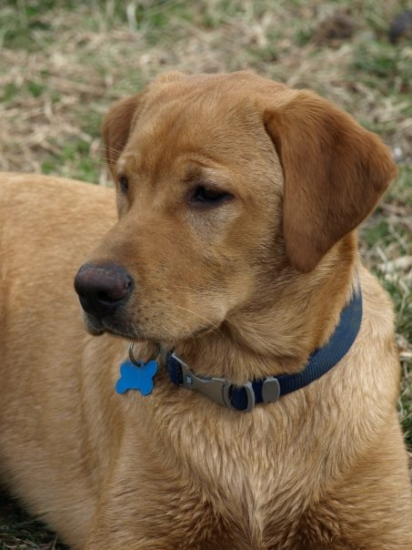

## Kalin's Personal Website

<body>
  

My name is Kalin Cormack, I am a senior ISAT major at James Madison University concentrating in Enviornmnet and sectoring in Energy. I am also a memeber of the Alpha Phi Fraternity. I am from Arlington, Virginia, but currently reside in Harrisonburg, Virginia for school. If you would like to know more about my education and career, you can visit my online resume <a href="https://kalincormack.github.io/Resume/">here</a>.

  
</body>  

### Interests

<body>

In my free time, I enjoy working on jigsaw puzzles, sudokus, and crossword puzzles. Some outdoor activies I enjoy is hiking and going on walks. The picture below is from one of my last hikes in the Shenandoah National Park.

</body>

<body>

<h5>My friend and I on the Frazier Discovery Trail in the Shenandoah National Park</h5>

</body>

<body>
  
  <h3>My Pets, Cody and Mittens</h3>

  
Cody is a 13 year old fox red lab and Mittens is about 8 years old and a polydactyl cat!

 
  
  <head>

</head>
<body>

  

  

    
  

  

    
  

  

    
  

  </body>  
 <body>
   
They are also best freinds.

  </body>
