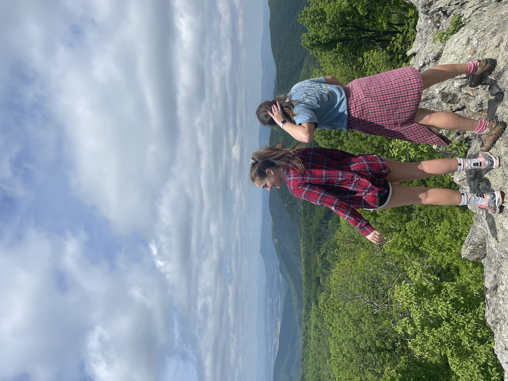

## Kalin's Personal Website

<body>
  

My name is Kalin Cormack, I am a senior ISAT major at James Madison University concentrating in Enviornmnet and sectoring in Energy. I am also a memeber of the Alpha Phi Fraternity. I am from Arlington, Virginia, but currently reside in Harrisonburg, Virginia for school. If you would like to know more about my education and career, you can visit my online resume <a href="https://kalincormack.github.io/Resume/">here</a>.

  
</body>  

### Interests

<body>

In my free time, I enjoy working on jigsaw puzzles, sudokus, and crossword puzzles. Some outdoor activies I enjoy is hiking and going on walks. The picture below is from one of my last hikes in the Shenandoah National Park.

</body>

<body>

<h5>My friend and I on the Frazier Discovery Trail in the Shenandoah National Park</h5>

</body>

<body>
  <h3>My Pets</h3>

Cody and Mittens

  
Cody is a 13 year old Fox Red Lab

  
Mittens is about 8 years old and is a polydactyl!

  
</body>

For more details see [GitHub Flavored Markdown](https://guides.github.com/features/mastering-markdown/).

### Jekyll Themes

Your Pages site will use the layout and styles from the Jekyll theme you have selected in your [repository settings](https://github.com/kalincormack/Personal-Website/settings/pages). The name of this theme is saved in the Jekyll `_config.yml` configuration file.

### Support or Contact

Having trouble with Pages? Check out our [documentation](https://docs.github.com/categories/github-pages-basics/) or [contact support](https://support.github.com/contact) and we’ll help you sort it out.
